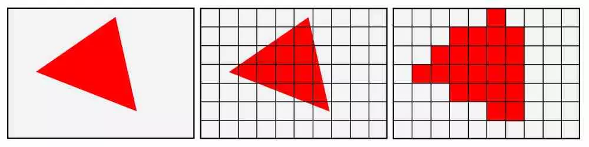
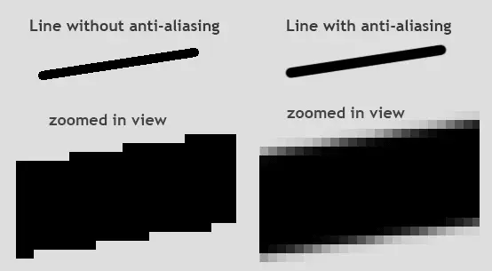
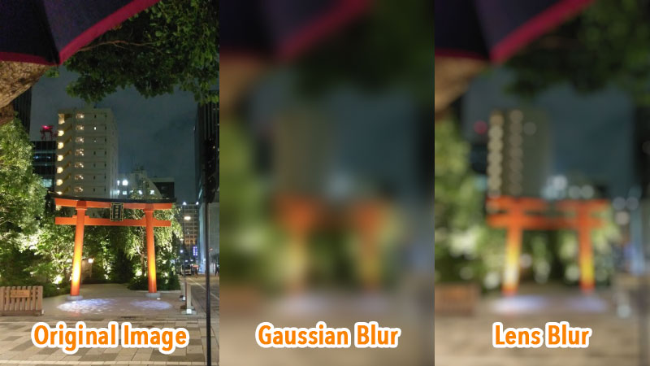
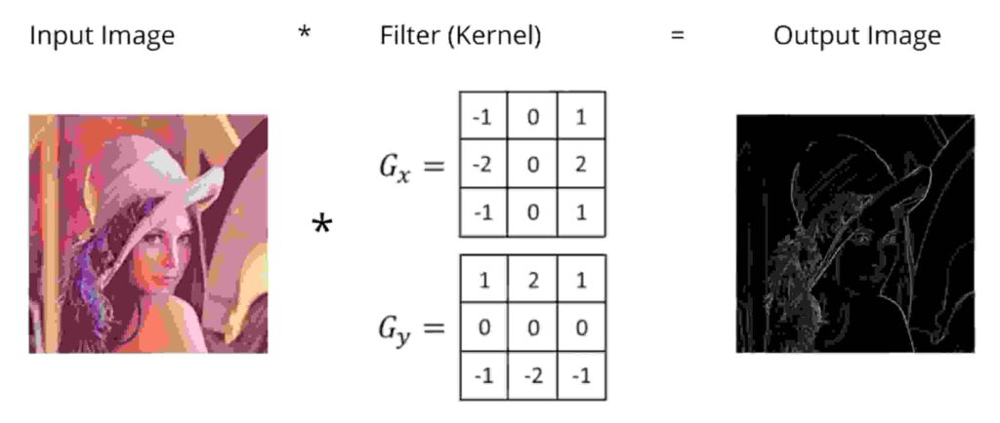

# Procesamiento de Imágenes

## Anti-Aliasing

¿Qué es el anti-aliasing?
Si juegas en PC, probablemente sepas lo que son los "Escalones" o "Dientes de Sierra". Esto sucede puesto que la tarjeta gráfica cuando genera un fotograma en 3D, 
lo que hace primero es calcular la posición de los objetos para luego proyectarla sobre una pantalla y pintar cada punto 
de un color distinto.

¿Qué ocurre cuando no hay suficientes píxeles? Pues que la falta de información produce el problema. Es decir, el Anti-Aliasing principalmente se produce por el hecho que la escena se ha renderizado a menos resolución de lo que sería ideal.

Te podrás dar cuenta de que la imagen de la derecha (en el ejemplo de abajo) tiene más resolución. 
Pues bien, si una imagen de gran resulución la haces más pequeña, da la sensación de no haber perdido información. En cambió, al contrario, la calidad de imagen se pierde considerablemente.

Evidentemente, activar este parámetro tiene un efecto positivo en la calidad visual de los juegos. Sin embargo, aplicar este filtro que mitiga los bordes de sierra tiene cierto impacto en el rendimiento y puede reducir (y seguramente lo haga) los FPS en los juegos.

## El filtro Gaussiano

Sirve para difuminar y eliminar ruido en las imágenes. Para que te formes la idea, se usa para difuminar las placas de los autos en los Reality Shows, tapar la cara de los niños en reportajes de Guerra, y muchas aplicaciones industriales.
Puedes Difuminar, dar un efecto de niebla, reducir efectos de interferencia, protejer testigos y resaltar objetos de interés.

Una de las aplicaciones del filtro Gaussiano con valores de desviacion estandar bajos es la eliminacion 
de ruido, artefactos y granulado de imagenes suavizando los efectos de estas «impurezas» sin sacrificar tanta nitidez en 
la imagen.

## Matriz de Convolución

La mayoria de los filtros usan matriz de convolución, con ella, se pueden crear filtros personalizado.

¿Que es una matriz de convolución? Convolución es el tratamiento de una matriz por otra que se llama “kernel”.

El filtro matriz de convolución usa una primera matriz que es la imagen que será tratada. La imagen es una colección bidimensional de píxeles en coordenada rectágular. El kernel usado depende del efecto deseado.

