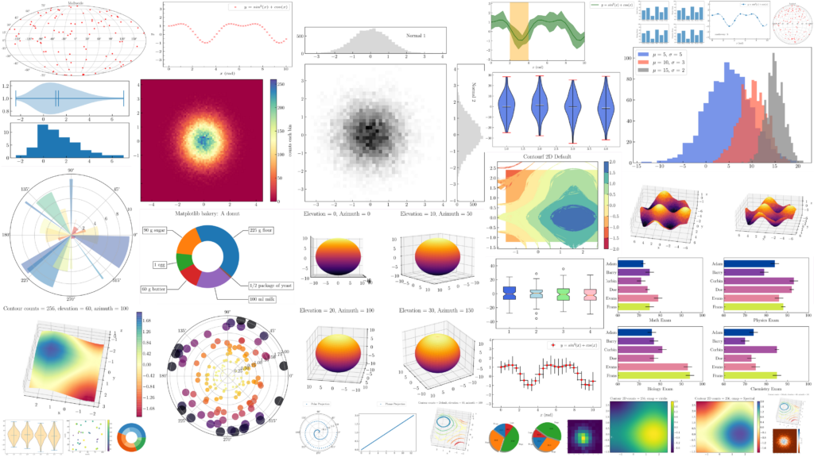

# Librería MatPlotLib

  

MatPlotLib es una librería de código abierto. Se utiliza para crear gráficas y diagramas de gran calidad. 
Por ejemplo, es posible crear ​​trazados, histogramas, diagramas de barra y cualquier tipo de gráfica con ayuda de algunas líneas de código. Se trata de una herramienta muy completa, que permite generar visualizaciones de datos muy detalladas.  
La utilizamos en códigos que requieren mostrar el movimiento de los astros.

## Lo más importante

1.  plot():

  Se utiliza para crear gráficos de líneas. Es una de las funciones más básicas y versátiles de matplotlib.

2.  scatter():

  Crea un diagrama de dispersión, ideal para mostrar la relación entre dos conjuntos de datos.

3.  bar():
 
  Genera un gráfico de barras verticales, para comparar cantidades en diferentes categorías.

4.  hist():

  Crea un histograma para mostrar la distribución de un conjunto de datos.

5.  pie():

Genera un gráfico de pastel, para mostrar proporciones relativas de diferentes categorías.

6.  imshow():

  Muestra una matriz de datos como una imagen, útil para visualizar datos 2D como mapas de calor.

Se pueden hacer una cantidad gigantesca de gráficos, además de que nos permite modificarlos, la lista es realmete grande, incluso muestro aquí un contenido resumido.

  

 
 
 

### Todo el contenido
        
acorr	              
angle_spectrum	      
annotate	         
arrow           	  
autoscale         
axes            	  
axhline	              
axhspan	             
axis	             
axvline	              
axvspan	             
bar                  
barbs	             
barh            	  
box	                  
boxplot         	  
broken_barh	         
cla	                
clabel          	  
clf	                
clim	            
close	              
cohere	             
colorbar             
contourf        	  
csd	                  
delaxes         	  
draw              
errorbar        	   
eventplot	           
figimage	          
figlegend	          
fignum_exists       
figtext	            
figure	            
fill            	  
fill_between    	  
matplotlib.axes.Axes  
matplotlib.axes.Axes.plot  
matplotlib.axes.Axes.scatter  
matplotlib.axes.Axes.bar  
matplotlib.axes.Axes.barh  
matplotlib.axes.Axes.hist  
matplotlib.axes.Axes.boxplot  
matplotlib.axes.Axes.errorbar  
matplotlib.axes.Axes.violinplot  
matplotlib.axes.Axes.pie  
matplotlib.axes.Axes.fill  
matplotlib.axes.Axes.fill_between  
matplotlib.axes.Axes.stackplot  
matplotlib.axes.Axes.step  
matplotlib.axes.Axes.plot_date  
matplotlib.axes.Axes.loglog  
matplotlib.axes.Axes.semilogx  
matplotlib.axes.Axes.semilogy  
matplotlib.axes.Axes.hexbin  
matplotlib.axes.Axes.imshow  
matplotlib.axes.Axes.matshow  
matplotlib.axes.Axes.contour  
matplotlib.axes.Axes.contourf  
matplotlib.axes.Axes.clabel  
matplotlib.axes.Axes.streamplot  
matplotlib.axes.Axes.quiver  
matplotlib.axes.Axes.quiverkey  
matplotlib.axes.Axes.specgram  
matplotlib.axes.Axes.cohere  
matplotlib.axes.Axes.psd  
matplotlib.axes.Axes.magnitude_spectrum  
matplotlib.axes.Axes.angle_spectrum  
matplotlib.axes.Axes.phase_spectrum  
matplotlib.axes.Axes.table  
matplotlib.axes.Axes.spatial  
matplotlib.axes.Axes.pcolor  
matplotlib.axes.Axes.pcolormesh  
matplotlib.axes.Axes.polar  
matplotlib.axes.Axes.xcorr  
matplotlib.axes.Axes.acorr  
matplotlib.axes.Axes.plot_surface  
matplotlib.axes.Axes.plot_wireframe  
matplotlib.axes.Axes.plot_trisurf  
matplotlib.axes.Axes.tripcolor  
matplotlib.axes.Axes.tricontour  
matplotlib.axes.Axes.tricontourf  
matplotlib.axes.Axes.triplot  
matplotlib.axes.Axes.legend  
matplotlib.axes.Axes.colorbar  
matplotlib.axes.Axes.grid  
matplotlib.axes.Axes.set  
matplotlib.axes.Axes.get  
matplotlib.axes.Axes.set_xlim  
matplotlib.axes.Axes.set_ylim  
matplotlib.axes.Axes.set_xscale  
matplotlib.axes.Axes.set_yscale  
matplotlib.axes.Axes.set_xticks  
matplotlib.axes.Axes.set_yticks  
matplotlib.axes.Axes.set_xticklabels  
matplotlib.axes.Axes.set_yticklabels  
matplotlib.axes.Axes.set_xlabel  
matplotlib.axes.Axes.set_ylabel  
matplotlib.axes.Axes.set_title  
matplotlib.axes.Axes.set_aspect  
matplotlib.axes.Axes.set_adjustable  
matplotlib.axes.Axes.set_anchor  
matplotlib.axes.Axes.set_facecolor  
matplotlib.axes.Axes.set_frame_on  
matplotlib.axes.Axes.set_rasterization_zorder  
matplotlib.axes.Axes.set_xmargin  
matplotlib.axes.Axes.set_ymargin  
matplotlib.axes.Axes.set_zorder  
matplotlib.axes.Axes.add_patch  
matplotlib.axes.Axes.add_line  
matplotlib.axes.Axes.add_collection  
matplotlib.axes.Axes.add_artist  
matplotlib.axes.Axes.add_container  
matplotlib.axes.Axes.add_image  
matplotlib.axes.Axes.add_table  
matplotlib.axes.Axes.add_cursor  
matplotlib.axes.Axes.add_figure  
matplotlib.figure.Figure  
matplotlib.figure.Figure.add_subplot  
matplotlib.figure.Figure.add_axes  
matplotlib.figure.Figure.add_gridspec  
matplotlib.figure.Figure.subplots  
matplotlib.figure.Figure.gca  
matplotlib.figure.Figure.gcf  
matplotlib.figure.Figure.clf  
matplotlib.figure.Figure.clear  
matplotlib.figure.Figure.delaxes  
matplotlib.figure.Figure.suptitle  
matplotlib.figure.Figure.set_canvas  
matplotlib.figure.Figure.set_constrained_layout  
matplotlib.figure.Figure.set_constrained_layout_pads  
matplotlib.figure.Figure.set_dpi  
matplotlib.figure.Figure.set_edgecolor  
matplotlib.figure.Figure.set_facecolor  
matplotlib.figure.Figure.set_figheight  
matplotlib.figure.Figure.set_figwidth  
matplotlib.figure.Figure.set_frameon  
matplotlib.figure.Figure.set_size_inches  
matplotlib.figure.Figure.set_tight_layout  
matplotlib.figure.Figure.savefig  
matplotlib.figure.Figure.canvas  
matplotlib.figure.Figure.dpi  
matplotlib.figure.Figure.get_axes  
matplotlib.figure.Figure.get_children  
matplotlib.figure.Figure.get_figheight  
matplotlib.figure.Figure.get_figwidth  
matplotlib.figure.Figure.get_frameon  
matplotlib.figure.Figure.get_size_inches  
matplotlib.figure.Figure.get_tight_layout  
matplotlib.figure.Figure.legend  
matplotlib.figure.Figure.colorbar  
matplotlib.figure.Figure.text  
matplotlib.figure.Figure.tight_layout  
matplotlib.pyplot  
matplotlib.pyplot.plot  
matplotlib.pyplot.scatter  
matplotlib.pyplot.bar  
matplotlib.pyplot.barh  
matplotlib.pyplot.hist  
matplotlib.pyplot.boxplot  
matplotlib.pyplot.errorbar  
matplotlib.pyplot.violinplot  
matplotlib.pyplot.pie  
matplotlib.pyplot.fill  
matplotlib.pyplot.fill_between  
matplotlib.pyplot.stackplot  
matplotlib.pyplot.step  
matplotlib.pyplot.plot_date  
matplotlib.pyplot.loglog  
matplotlib.pyplot.semilogx  
matplotlib.pyplot.semilogy  
matplotlib.pyplot.hexbin  
matplotlib.pyplot.imshow  
matplotlib.pyplot.matshow  
matplotlib.pyplot.contour  
matplotlib.pyplot.contourf  
matplotlib.pyplot.clabel  
matplotlib.pyplot.streamplot  
matplotlib.pyplot.quiver  
matplotlib.pyplot.quiverkey  
matplotlib.pyplot.specgram  
matplotlib.pyplot.cohere  
matplotlib.pyplot.psd  
matplotlib.pyplot.magnitude_spectrum  
matplotlib.pyplot.angle_spectrum  
matplotlib.pyplot.phase_spectrum  
matplotlib.pyplot.table  
matplotlib.pyplot.spatial  
matplotlib.pyplot.pcolor  
matplotlib.pyplot.pcolormesh  
matplotlib.pyplot.polar  
matplotlib.pyplot.xcorr  
matplotlib.pyplot.acorr  
matplotlib.pyplot.plot_surface  
matplotlib.pyplot.plot_wireframe  
matplotlib.pyplot.plot_trisurf  
 
Y paletas de colores

      inferno     perceptually uniform shades of black-red-yellow
      magma       perceptually uniform shades of black-red-white
      plasma      perceptually uniform shades of blue-red-yellow
      viridis     perceptually uniform shades of blue-green-yellow
      BrBG      brown, white, blue-green
      PiYG      pink, white, yellow-green
      PRGn      purple, white, green
      PuOr      orange, white, purple
      RdBu      red, white, blue
      RdGy      red, white, gray
      RdYlBu    red, yellow, blue
      RdYlGn    red, yellow, green
      Spectral  red, orange, yellow, green, blue

