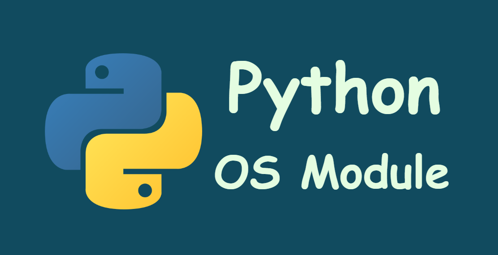

# Librería OS

  

Es una biblioteca estándar que proporciona una interfaz para interactuar con el sistema operativo en el que se ejecuta el programa. Permite realizar operaciones relacionadas con la gestión de archivos, directorios, rutas, variables de entorno y otras funcionalidades del sistema operativo.

## Lo más importante

1.  os.path.exists(): 

    Verifica si una ruta o archivo existe.

2.  os.remove(): 

    Elimina un archivo.

3.  os.system(): 

    Ejecuta un comando del sistema.

4.  os.abort():

    Termina un proceso que se esté ejecutando.

 
 
 

### Todo el contenido

os.name       
os.environ  
os.chdir()              
os.getcwd  
os.getenv  
os.putenv  
os.mkdir  
os.makedirs  
os.remove  
os.rename  
os.rmdir  
os.startfile  
os.walk  
os.path  
os.abort  
os.access  
os.chdir  
os.chflags  
os.chmod  
os.chown  
os.chroot  
os.close  
os.closerange  
os.dup  
os.dup2  
os.fchmod  
os.fchown  
os.fdatasync  
os.fdopen  
os.fork  
os.forkpty  
os.fpathconf  
os.fstat  
os.fstatvfs  
os.fsync  
os.ftruncate  
os.get_blocking  
os.get_exec_path  
os.get_inheritable  
os.get_terminal_size  
os.getcwd  
os.getcwdb  
os.getegid  
os.geteuid  
os.getgid  
os.getgrouplist  
os.getgroups  
os.getloadavg  
os.getlogin  
os.getpgid  
os.getpgrp  
os.getpid  
os.getppid  
os.getpriority  
os.getresgid  
os.getresuid  
os.getsid  
os.getuid  
os.initgroups  
os.isatty  
os.kill  
os.killpg  
os.lchflags  
os.lchmod  
os.lchown  
os.link  
os.listdir  
os.lockf  
os.lseek  
os.lstat  
os.major  
os.makedev  
os.makedirs  
os.minor  
os.mkdir  
os.mkfifo  
os.mknod  
os.name  
os.open  
os.openpty  
os.pathconf  
os.pipe  
os.popen  
os.posix_fadvise  
os.posix_fallocate  
os.posix_spawn  
os.posix_spawnp  
os.putenv  
os.read  
os.readlink  
os.readv  
os.remove  
os.removedirs  
os.rename  
os.renames  
os.rmdir  
os.scandir  
os.sched_get_priority_max  
os.sched_get_priority_min  
os.sched_getaffinity  
os.sched_getparam  
os.sched_getscheduler  
os.sched_rr_get_interval  
os.sched_setaffinity  
os.sched_setparam  
os.sched_setscheduler  
os.sched_yield  
os.sendfile  
os.set_blocking  
os.set_inheritable  
os.setegid  
os.seteuid  
os.setgid  
os.setgroups  
os.sethostname  
os.setpgid  
os.setpgrp  
os.setpriority  
os.setregid  
os.setresgid  
os.setresuid  
os.setreuid  
os.setsid  
os.setuid  
os.spawnl  
os.spawnle  
os.spawnlp  
os.spawnlpe  
os.spawnv  
os.spawnve  
os.spawnvp  
os.spawnvpe  
os.stat  
os.statvfs  
os.strerror  
os.symlink  
os.sync  
os.sysconf  
os.tcgetpgrp  
os.tcsetpgrp  
os.ttyname  
os.umask  
os.uname  
os.unlink  
os.unsetenv  
os.urandom  
os.utime  
os.wait  
os.wait3  
os.wait4  
os.waitid  
os.waitpid  
os.walk  
os.write  
os.writev  
os.cpu_count  
os.device_encoding  
os.getenv  
os.getpid  
os.path  
os.sep  
os.system  
os.times  
os.ctermid  
os.confstr  
os.dup  
os.dup2  
os.execv  
os.execve  
os.execvp  
os.execvpe  
os.forkpty  
os.ftruncate  
os.getenvb  