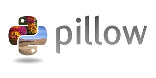

#   Librería pillow

  

Python Imaging Library (PIL) es una librería que permite la edición de imágenes directamente desde 
Python. Soporta una variedad de formatos, incluídos los más utilizados como GIF, JPEG y PNG. 
 
Es una herramienta poderosa y versátil que te permite realizar tareas como:
 
Cargar imágenes desde archivos.         
Modificar el tamaño y la resolución de una imagen.  
Aplicar filtros y efectos a las imágenes.  
Realizar operaciones de recorte y rotación.  
Guardar imágenes en diferentes formatos, como JPEG, PNG, BMP, etc.  

## Lo más importante

1.  Image.open():

    Abre y carga una imagen desde un archivo.

2.  Image.save():

    Guarda la imagen actual en un archivo.

3.  Image.show():

    Muestra la imagen.

4.  Image.resize():

    Cambia el tamaño de la imagen a una nueva anchura y altura especificadas.

5.  Image.crop():

    Recorta una región rectangular de la imagen. La región se define mediante una tupla de coordenadas (left, upper, right, lower).

6.  Image.rotate():

    Rota la imagen el número de grados especificado en sentido antihorario.

 
 
 

### Todo el contenido

PIL._binary  
PIL._deprecate  
PIL._imaging  
PIL._tkinter_finder  
PIL._typing  
PIL._util  
PIL._version  
PIL.BdfFontFile  
PIL.BmpImagePlugin  
PIL.BufrStubImagePlugin  
PIL.ContainerIO  
PIL.CurImagePlugin  
PIL.DcxImagePlugin  
PIL.DdsImagePlugin  
PIL.EpsImagePlugin  
PIL.ExifTags  
PIL.features  
PIL.FitsImagePlugin  
PIL.FliImagePlugin  
PIL.FontFile  
PIL.FpxImagePlugin  
PIL.GbrImagePlugin  
PIL.GdImageFile  
PIL.GifImagePlugin  
PIL.GimpGradientFile  
PIL.GimpPaletteFile  
PIL.GribStubImagePlugin  
PIL.Hdf5StubImagePlugin  
PIL.IcnsImagePlugin  
PIL.IcoImagePlugin  
PIL.Image  
PIL.Image.core  
PIL.ImageChops  
PIL.ImageCms  
PIL.ImageColor  
PIL.ImageDraw  
PIL.ImageDraw2  
PIL.ImageEnhance  
PIL.ImageFile  
PIL.ImageFilter  
PIL.ImageFont  
PIL.ImageGrab  
PIL.ImageMath  
PIL.ImageMode  
PIL.ImageMorph  
PIL.ImageOps  
PIL.ImagePalette  
PIL.ImagePath  
PIL.ImageQt  
PIL.ImageSequence  
PIL.ImageShow  
PIL.ImageStat  
PIL.ImageTk  
PIL.ImageTransform  
PIL.ImageWin  
PIL.ImImagePlugin  
PIL.ImtImagePlugin  
PIL.IptcImagePlugin  
PIL.Jpeg2KImagePlugin  
PIL.JpegImagePlugin  
PIL.JpegPresets  
PIL.McIdasImagePlugin  
PIL.MicImagePlugin  
PIL.MpegImagePlugin  
PIL.MspImagePlugin  
PIL.PaletteFile  
PIL.PalmImagePlugin  
PIL.PcdImagePlugin  
PIL.PcfFontFile  
PIL.PcxImagePlugin  
PIL.PdfImagePlugin  
PIL.PixarImagePlugin  
PIL.PngImagePlugin  
PIL.PpmImagePlugin  
PIL.PsdImagePlugin  
PIL.PSDraw  
PIL.PyAccess  
PIL.SgiImagePlugin  
PIL.SpiderImagePlugin  
PIL.SunImagePlugin  
PIL.TarIO  
PIL.TgaImagePlugin  