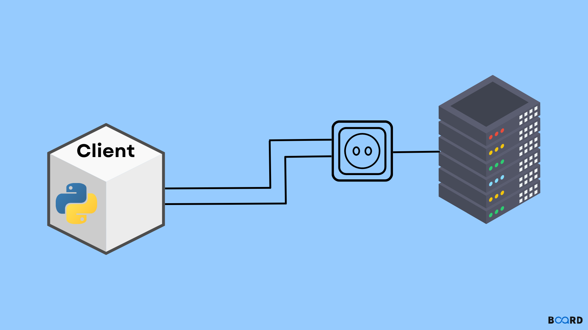

# Librería Socket

  

Los sockets son una estructura que permite la conexión entre dos aplicaciones, procesos o equipos, estableciendo una relación cliente/servidor, que permite el intercambio de datos, incluso entre programas colocados en ordenadores diferentes.  
Este módulo lo utilizamos para conectar distintas computadoras y compartir archivos.

## Lo más importante

1.  socket.socket()

    Crea un objeto socket.

2.  socket.connect():

    Conecta el socket a una dirección remota (IP y el número de puerto). Lo vuelve un cliente.

3.  socket.listen():

    Permite que el socket acepte conexiones. Lo vuelve un servidor.

4.  socket.accept():

    Acepta una conexión entrante. Devuelve un nuevo socket conectado y la dirección del cliente.

5.  socket.send():

    Envía datos a través del socket. Los datos deben ser de tipo bytes.

 
 
 

### Todo el contenido

socket()  
socketpair()  
fromfd()  
send_fds()  
recv_fds()   
fromshare()  
gethostname()  
gethostbyname()  
gethostbyaddr()  
getservbyname()  
getprotobyname()  
ntohs(), ntohl()  
htons(), htonl()  
inet_aton()  
inet_ntoa()  
socket.getdefaulttimeout()  
socket.setdefaulttimeout()  
create_connection()  

