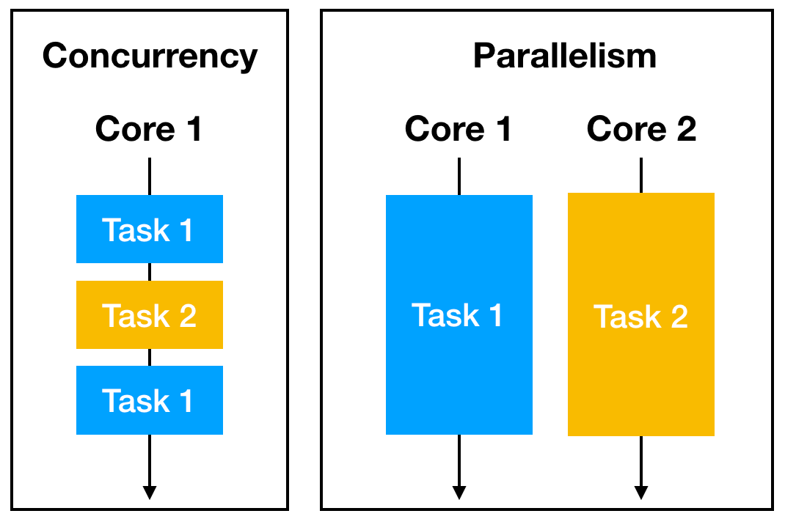

# Librería Threading

  

Los hilos nos permiten aprovechar las capacidades multiprocesador de nuestras máquinas para ejecutar varias instrucciones a la vez, como subprocesos independientes.

## Lo más importante

1.  threading.Thread():

    Crea un nuevo hilo de ejecución. Permite especificar la función a ejecutar y los argumentos de esa función.

2.  threading.Lock():

    Crea un objeto de bloqueo. Los bloqueos se utilizan para asegurar que solo un hilo acceda a una sección crítica del código a la vez.

3.  threading.Event():

    Crea un objeto de evento. Los eventos se utilizan para la comunicación entre hilos, permitiendo a un hilo esperar a que otro hilo le notifique.

4.  threading.current_thread():

    Devuelve el objeto del hilo actual, permitiendo acceder a sus atributos y métodos.

5.  threading.Timer():

    Crea un temporizador que ejecuta una función después de un tiempo especificado.

6.  threading.RLock:

    Crea un bloqueo reentrante. A diferencia de un bloqueo normal, un RLock puede ser adquirido varias veces por el mismo hilo.

 
 
 

### Todo el contenido

threading.active_count  
threading.Condition  
threading.current_thread  
threading.enumerate  
threading.Event  
threading.get_ident  
threading.get_native_id  
threading.local  
threading.Lock  
threading.main_thread  
threading.RLock  
threading.Semaphore  
threading.BoundedSemaphore  
threading.setprofile  
threading.settrace  
threading.stack_size  
threading.Thread  
threading.TIMEOUT_MAX  
threading.Timer  
threading.Barrier  
threading.BrokenBarrierError  
threading.wait  
threading.excepthook  
threading.TIMEOUT_MAX  
threading.ThreadError  
threading.thread_time  
threading.thread_time_ns  
threading.TIMEOUT_MAX  
threading.LockType  
threading.Thread.setName  
threading.Thread.getName  
threading.Thread.is_alive  
threading.Thread.isDaemon  
threading.Thread.join  
threading.Thread.run  
threading.Thread.start  
threading.Thread.getName  
threading.Thread.ident  
threading.Thread.name  
threading.Thread.daemon  
threading.Thread.native_id  
threading.Thread.target  
threading.Thread.setName  
threading.Thread.getName  
threading.Thread.is_alive  
threading.Thread.isDaemon  
threading.Thread.join  
threading.Thread.run  
threading.Thread.start  
threading.Thread.getName  
threading.Thread.ident  
threading.Thread.name  
threading.Thread.daemon  
threading.Thread.native_id  
threading.Thread.target  
threading.Lock.acquire  
threading.Lock.release  
threading.Lock.locked  
threading.RLock.acquire  
threading.RLock.release  
threading.RLock.locked  
threading.RLock._acquire_restore  
threading.RLock._is_owned  
threading.RLock._release_save  
threading.Condition.acquire  
threading.Condition.release  
threading.Condition.wait  
threading.Condition.notify  
threading.Condition.notify_all  
threading.Condition.wait_for  
threading.Event.clear  
threading.Event.is_set  
threading.Event.set  
threading.Event.wait  
threading.Semaphore.acquire  
threading.Semaphore.release  
threading.BoundedSemaphore.acquire  
threading.BoundedSemaphore.release  
threading.Barrier.abort  
threading.Barrier.reset  
threading.Barrier.wait  
threading.local.__getattribute__  
threading.local.__setattr__  
threading.local.__delattr__  
threading.local.__dict__  
threading.main_thread  
threading.get_native_id  
threading.excepthook  
threading.setprofile  
threading.settrace  
threading.stack_size  
threading.TIMEOUT_MAX  
threading.TIMEOUT_MAX  
threading._after_fork  
threading._enumerate  
threading._active  
threading._pickled_thread  
threading._pickled_main_thread  
threading._register_at_fork  
threading._shutdown  
threading._start_new_thread  
threading._terminate  
threading._timer  
threading._unwind_forked  
threading._unwind_defer  
threading._warnings  
threading._WeakSet  
threading._time  
threading._state_lock  
threading._bootstrap  
threading._bootstrap_inner  
threading._delete  
threading._finish  
threading._initialized  
threading._interpreter_lock  
threading._lock  
threading._note  
threading._profile_hook  
threading._sys  
threading._thread  
threading._thread_time  
threading._trace_hook  
threading._traceback  
threading._warn  
threading._warn_unclosed_file  
threading._warn_unclosed_socket  
threading._warn_unclosed_files  
threading._warn_unclosed_sockets  
threading._wrapper  
threading.__all__  
threading.__builtins__  
threading.__cached__  
threading.__doc__  
threading.__file__  
threading.__loader__  
threading.__name__  
threading.__package__  
threading.__spec__  
threading.__warn__  
threading.__warnings__  
threading.__warningregistry__  
threading.__traceback__  
threading.__traceback_limit__  
threading.__exit__  
threading.__enter__  
threading.__init__  
threading.__main__  
threading.__message__  
threading.__stderr__  
threading.__stderr__  