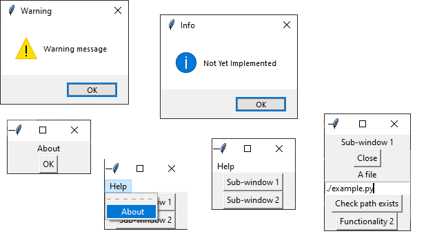

# Librería Tkinter

  

Tkinter es una vinculación de la biblioteca gráfica Tcl/Tk para el lenguaje de programación Python, con estos queremos decir que Tk se encuentra disponible para varios lenguajes de programación entre los cuales se encuentra Python con el nombre de Tkinter.

## Lo más importante

Los widgets son parte vital de esta interfaz, así que procedo a mencionar los más importantes.

1.  Tk:

    Es la raíz de la interfaz, donde vamos a colocar el resto de widgets.

2.  Frame: 

    Marco que permite agrupar diferentes widgets.

3.  Label: 
    
    Etiqueta estática que permite mostrar texto o imagen.

4.  Entry: 

    Etiqueta que permite introducir texto corto.

5.  Text: 

    Campo que permite introducir texto largo.

6.  Button: 

    Ejecuta una función al ser pulsado.

7.  Radiobutton: 
    
    Permite elegir una opción entre varias.

8.  Checkbutton: 

    Permite elegir varias de las opciones propuestas.

9.  Menu: l

    Cásico menú superior con opciones.

10. Dialogs:

    Ventana emergente (o pop-up).

 
 

  

 
 
 

### Todo el contenido

tkinter.Tk  
tkinter.Toplevel  
tkinter.Frame  
tkinter.Label  
tkinter.Button  
tkinter.Entry  
tkinter.Text  
tkinter.Canvas  
tkinter.Menu  
tkinter.Menubutton  
tkinter.Checkbutton  
tkinter.Radiobutton  
tkinter.Scale  
tkinter.Scrollbar  
tkinter.Listbox  
tkinter.Message  
tkinter.Spinbox  
tkinter.PanedWindow  
tkinter.LabelFrame  
tkinter.ttk.Combobox  
tkinter.ttk.Treeview  
tkinter.ttk.Progressbar  
tkinter.ttk.Notebook  
tkinter.ttk.Style  
tkinter.ttk.Sizegrip  
tkinter.ttk.Separator  
tkinter.ttk.PanedWindow  
tkinter.ttk.LabelFrame  
tkinter.ttk.Labelframe  
tkinter.ttk.LabeledScale  
tkinter.ttk.LabeledRadiobutton  
tkinter.ttk.LabeledCheckbutton  
tkinter.ttk.LabeledButton  
tkinter.ttk.LabeledEntry  
tkinter.ttk.LabeledFrame  
tkinter.ttk.LabeledScale  
tkinter.ttk.LabeledLabel  
tkinter.ttk.LabeledListbox  
tkinter.ttk.LabeledMenu  
tkinter.ttk.LabeledMenubutton  
tkinter.ttk.LabeledMessage  
tkinter.ttk.LabeledOptionMenu  
tkinter.ttk.LabeledPanedWindow  
tkinter.ttk.LabeledProgressbar  
tkinter.ttk.LabeledRadiobutton  
tkinter.ttk.LabeledScale  
tkinter.ttk.LabeledScrollbar  
tkinter.ttk.LabeledSeparator  
tkinter.ttk.LabeledSizegrip  
tkinter.ttk.LabeledSpinbox  
tkinter.ttk.LabeledStyle  
tkinter.ttk.LabeledTreeview  
tkinter.StringVar  
tkinter.IntVar  
tkinter.DoubleVar  
tkinter.BooleanVar  
tkinter.Variable  
tkinter.E  
tkinter.W  
tkinter.N  
tkinter.S  
tkinter.NE  
tkinter.NW  
tkinter.SE  
tkinter.SW  
tkinter.CENTER  
tkinter.TOP  
tkinter.BOTTOM  
tkinter.LEFT  
tkinter.RIGHT  
tkinter.X  
tkinter.Y  
tkinter.BOTH  
tkinter.NONE  
tkinter.HORIZONTAL  
tkinter.VERTICAL  
tkinter.END  
tkinter.ANCHOR  
tkinter.ACTIVE  
tkinter.DISABLED  
tkinter.NORMAL  
tkinter.LEFT  
tkinter.RIGHT  
tkinter.BOTTOM  
tkinter.TOP  
tkinter.PACK  
tkinter.GRID  
tkinter.PLACE  
tkinter.WORD  
tkinter.CHAR  
tkinter.BEVEL  
tkinter.RAISED  
tkinter.SUNKEN  
tkinter.FLAT  
tkinter.GROOVE  
tkinter.RIDGE  
tkinter.ALL  
tkinter.FIRST  
tkinter.LAST  
tkinter.LEFT  
tkinter.RIGHT  
tkinter.BOTTOM  
tkinter.TOP  
tkinter.SE  
tkinter.SW  
tkinter.NE  
tkinter.NW  
tkinter.ROUND  
tkinter.BUTT  
tkinter.PROJECTING  
tkinter.CURRENT  
tkinter.RESET  
tkinter.END  
tkinter.INSERT  
tkinter.INSERT  
tkinter.SELECTION  
tkinter.SCROLL  
tkinter.MOVETO  
tkinter.UNITS  
tkinter.PAGES  
tkinter.WORDS  
tkinter.BOTH  
tkinter.N  
tkinter.S  
tkinter.E  
tkinter.W  
tkinter.MIDDLE  
tkinter.TOP  
tkinter.BOTTOM  
tkinter.CENTER  
tkinter.PLACE  
tkinter.PACK  
tkinter.GRID  
tkinter.ACTIVE  
tkinter.ALL  
tkinter.ANCHOR  
tkinter.BEVEL  
tkinter.BOTH  
tkinter.BOTTOM  
tkinter.FLAT  
tkinter.FIRST  
tkinter.GROOVE  
tkinter.LAST  
tkinter.NONE  
tkinter.NORMAL  
tkinter.RAISED  
tkinter.RIDGE  
tkinter.SUNKEN  
tkinter.DISABLED  
tkinter.SCROLL  