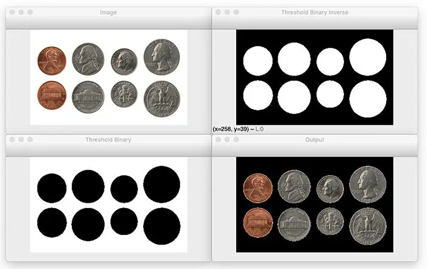

# Librería cv2

  

Se utiliza a menudo para el procesamiento de imágenes y vídeo. Proporciona a los desarrolladores una interfaz fácil de usar para trabajar con funciones de procesamiento de imágenes y vídeo. Es por esto que en nuestros códigos que requirieron generar imágenes para la animación final, recurrimos a ésta.

## Lo más importante

Una biblioteca, tal como lo indica el nombre, es gigante, pero a continuación listaré un par de las funciones más importantes y usadas de OpenCV. No obstante, más abajo se listan todas y cada una de ellas.

1.  cv2.imread():

    Es una función para leer una imagen de un archivo. Toma la ruta del archivo como entrada y devuelve un array numpy que contiene la imagen. 

2.  cv2.resize():

    Es una función que se utiliza para cambiar el tamaño de una imagen. Toma la imagen de entrada y las nuevas dimensiones como entradas y devuelve la imagen redimensionada.

3.  cv2.imshow():

    Es una función utilizada para mostrar una imagen. Toma la imagen como entrada y abre una nueva ventana para mostrar la imagen. 

4.  cv2.imwrite():

    Es una función para guardar una imagen en un archivo. Toma la imagen y la ruta del archivo como entrada y guarda la imagen en la ruta del archivo.

5.  cv2.threshold():

    Es una función que se puede utilizar para umbralizar una imagen. Toma la imagen de entrada y un valor umbral como entrada y devuelve la imagen umbralizada. A continuación, un ejemplo para clarificar:

    

6.  cv2.rectangle():

    Es una función para dibujar un rectángulo en una imagen. Toma la imagen de entrada, las coordenadas del rectángulo, el color y el grosor como entradas y devuelve la imagen con el rectángulo dibujado.

7.  cv2.findContours():

    Es una función que se utiliza para encontrar los contornos en una imagen. Toma la imagen de entrada, el modo de recuperación del contorno y el método de aproximación del contorno como entradas y devuelve los contornos. 

### Todo el contenido

cv2.absdiff                  
cv2.accumulate 
cv2.accumulateProduct 
cv2.accumulateSquare 
cv2.accumulateWeighted 
cv2.adaptiveThreshold 
cv2.add 
cv2.addText 
cv2.addWeighted 
cv2.applyColorMap 
cv2.approxPolyDP 
cv2.arcLength 
cv2.arrowedLine 
cv2.batchDistance 
cv2.bilateralFilter 
cv2.bitwise_and 
cv2.bitwise_not 
cv2.bitwise_or 
cv2.bitwise_xor 
cv2.blur 
cv2.boundingRect 
cv2.boxFilter 
cv2.boxPoints 
cv2.buildOpticalFlowPyramid 
cv2.calcBackProject 
cv2.calcCovarMatrix 
cv2.calcHist 
cv2.calcOpticalFlowFarneback 
cv2.calcOpticalFlowPyrLK 
cv2.calibrateCamera 
cv2.calibrationMatrixValues 
cv2.CamShift 
cv2.Canny 
cv2.cartToPolar 
cv2.CascadeClassifier 
cv2.circle 
cv2.clipLine 
cv2.colorChange 
cv2.compare 
cv2.compareHist 
cv2.completeSymm 
cv2.composeRT 
cv2.computeCorrespondEpiline 
cv2.connectedComponents 
cv2.connectedComponentsWithStats     
cv2.contourArea 
cv2.convertMaps 
cv2.convertPointsFromHomogeneous 
cv2.convertPointsToHomogeneous 
cv2.convertScaleAbs 
cv2.convexHull 
cv2.convexityDefects 
cv2.copyMakeBorder 
cv2.cornerEigenValsAndVecs 
cv2.cornerHarris 
cv2.cornerMinEigenVal 
cv2.cornerSubPix 
cv2.cornerEigenValsAndVecs 
cv2.cornerMinEigenVal 
cv2.cornerSubPix 
cv2.createAlignMTB 
cv2.createBackgroundSubtractorKNN 
cv2.createBackgroundSubtractorMOG2 
cv2.createButton 
cv2.createCLAHE 
cv2.createLineSegmentDetector 
cv2.createMergeDebevec 
cv2.createMergeMertens 
cv2.createMergeRobertson 
cv2.createTonemap 
cv2.createTonemapDrago 
cv2.createTonemapMantiuk 
cv2.createTonemapReinhard 
cv2.cvtColor 
cv2.dct 
cv2.decolor 
cv2.demosaicing 
cv2.destroyAllWindows 
cv2.destroyWindow 
cv2.detailEnhance 
cv2.detail_HomographyBasedEstimator 
cv2.detail_BestOf2NearestMatcher 
cv2.detail_BestOf2NearestRangeMatcher 
cv2.detail_Blender 
cv2.detail_CameraParams 
cv2.detail_ChannelsCompensator 
cv2.detail_DpSeamFinder 
cv2.detail_Estimator 
cv2.detail_FeatherBlender 
cv2.detail_FeaturesMatcher 
cv2.detail_GainCompensator 
cv2.detail_GraphCutSeamFinder 
cv2.detail_HomographyBasedEsti mator
cv2.detail_Interpolator 
cv2.detail_MultiBandBlender 
cv2.detail_NoBundleAdjuster 
cv2.detail_NoSeamFinder 
cv2.detail_SeamFinder 
cv2.detail_Timelapser 
cv2.detail_TimelapserCrop 
cv2.detail_VoronoiSeamFinder 
cv2.determinant 
cv2.dft 
cv2.dilate 
cv2.distanceTransform 
cv2.distanceTransformWithLabel s
cv2.divide 
cv2.drawChessboardCorners 
cv2.drawContours 
cv2.drawKeypoints 
cv2.drawMatches 
cv2.drawMatchesKnn 
cv2.ellipse 
cv2.ellipse2Poly 
cv2.equalizeHist 
cv2.erode 
cv2.error 
cv2.estimateAffine2D 
cv2.estimateAffine3D 
cv2.estimateAffinePartial2D 
cv2.estimateRigidTransform 
cv2.fastAtan2 
cv2.fastNlMeansDenoising 
cv2.fastNlMeansDenoisingColored 
cv2.fastNlMeansDenoisingColoredMulti 
cv2.fastNlMeansDenoisingMulti 
cv2.fillConvexPoly 
cv2.fillPoly 
cv2.filter2D 
cv2.findChessboardCorners 
cv2.findContours 
cv2.findEssentialMat 
cv2.findFundamentalMat 
cv2.findHomography 
cv2.findNonZero 
cv2.findTransformECC 
cv2.fitEllipse 
cv2.fitEllipseAMS 
cv2.fitEllipseDirect 
cv2.fitLine 
cv2.floodFill 
cv2.gemm 
cv2.getAffineTransform 
cv2.getBuildInformation 
cv2.getCPUTickCount 
cv2.getDefaultNewCameraMatrix 
cv2.getDerivKernels 
cv2.getGaborKernel 
cv2.getGaussianKernel 
cv2.getOptimalDFTSize 
cv2.getOptimalNewCameraMatrix 
cv2.getPerspectiveTransform 
cv2.getRectSubPix 
cv2.getRotationMatrix2D 
cv2.getStructuringElement 
cv2.getTextSize 
cv2.getTickCount 
cv2.getTickFrequency 
cv2.getTrackbarPos 
cv2.getValidDisparityROI 
cv2.getWindowImageRect 
cv2.getWindowProperty 
cv2.goodFeaturesToTrack 
cv2.grabCut 
cv2.grab 
cv2.haveImageReader 
cv2.haveImageWriter 
cv2.hconcat 
cv2.idct 
cv2.idft 
cv2.imshow 
cv2.imdecode 
cv2.imencode 
cv2.imread 
cv2.imreadmulti 
cv2.imshow 
cv2.inRange 
cv2.initCameraMatrix2D 
cv2.initUndistortRectifyMap 
cv2.inpaint 
cv2.invert 
cv2.invertAffineTransform 
cv2.isContourConvex 
cv2.kmeans 
cv2.line 
cv2.linearPolar 
cv2.log 
cv2.logPolar 
cv2.LUT 
cv2.magnitude 
cv2.map 
cv2.matchShapes 
cv2.matchTemplate 
cv2.matMulDeriv 
cv2.mean 
cv2.meanShift 
cv2.meanStdDev 
cv2.merge 
cv2.minAreaRect 
cv2.minEnclosingCircle 
cv2.minEnclosingTriangle 
cv2.minMaxLoc 
cv2.moments 
cv2.morphologyEx 
cv2.moveWindow 
cv2.mulSpectrums 
cv2.multiply 
cv2.namedWindow 
cv2.norm 
cv2.normalize 
cv2.ORB_create 
cv2.ocl 
cv2.pencilSketch 
cv2.perspectiveTransform 
cv2.phase 
cv2.phaseCorrel 